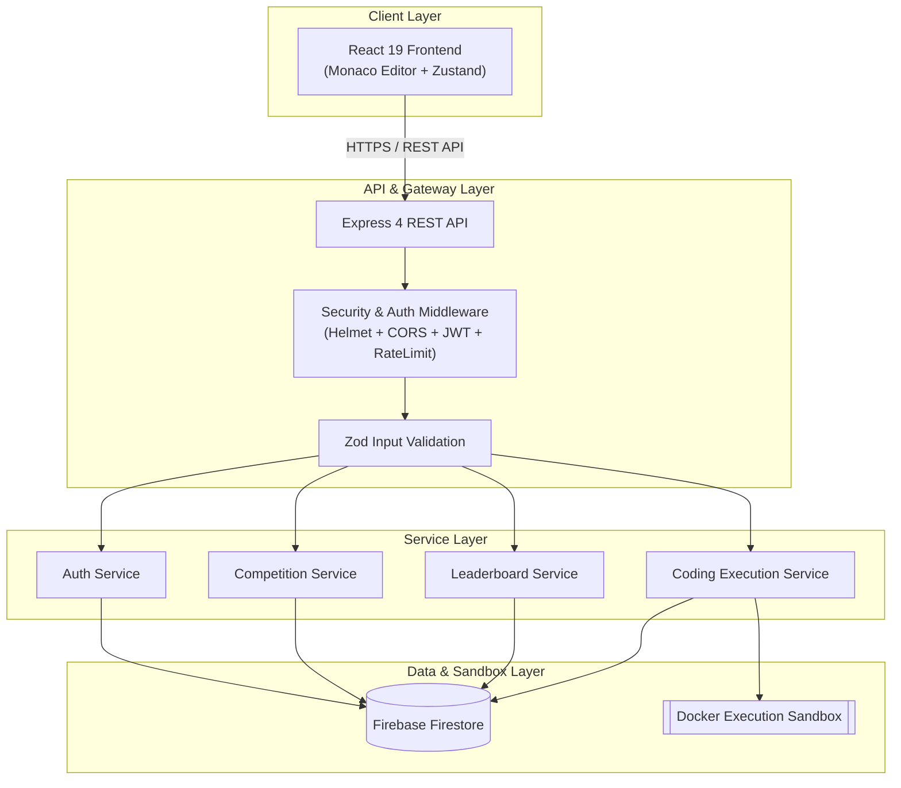
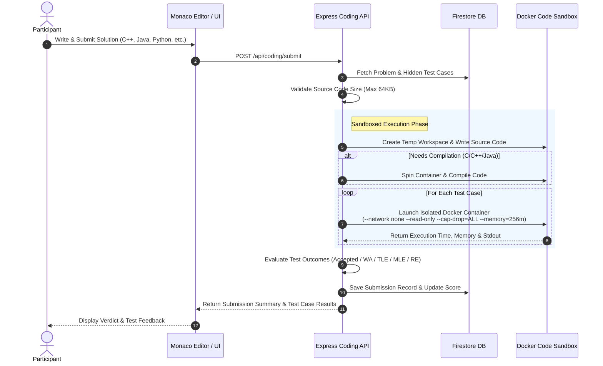

# ACM Competition Platform

> A production-grade, full-stack competitive programming and technical competition platform built for ACM events.

[](https://nodejs.org/)
[](https://react.dev/)
[](https://www.typescriptlang.org/)
[](https://www.docker.com/)
[](LICENSE)

---

## 🚀 Overview

**ACM Competition Platform** is a full-featured technical competition system built specifically for hosting university and college-level ACM programming competitions, hackathons, and technical quizzes. 

It provides real-time multi-round competition management, interactive MCQ assessments, an isolated **multi-language Docker code judge**, instant automated test case grading with hidden test cases, live leaderboards, and an administrative control center.

---

## ✨ Features

### 🔒 User & Auth System
- Email OTP-based verification & passwordless login options.
- Role-based authorization (`admin`, `participant`).
- Secure JWT authentication with HTTP-only cookies / token state.
- Rate-limited authentication endpoints & brute-force protection.

### 🏆 Competition & Round Management
- Multi-round competition support (e.g., Round 1: MCQ Quiz, Round 2: Coding Challenge).
- Server-authoritative start & end time enforcement.
- Participant registration management & status tracking.

### 📝 MCQ Competition Engine
- Randomized question and option order per participant.
- Automatic server-side score calculation and immediate grading.
- Partial and negative marking options.

### ⚡ Multi-Language Docker Code Sandbox
- Code execution for **C**, **C++ (C++17)**, **Java 17**, **Python 3**, and **JavaScript (Node.js)**.
- Secure, isolated Docker container execution per test case.
- Hidden test cases with Time Limit Exceeded (TLE) & Memory Limit Exceeded (MLE) bounds.
- System call & security restrictions: `--cap-drop=ALL`, `--security-opt=no-new-privileges`, read-only filesystems, and zero network access.
- Compilation and runtime error extraction with clean feedback.

### 📊 Real-Time Leaderboard & Results
- Live competition scoreboard supporting time penalty calculations (ACM rules).
- Automated aggregation across multiple competition rounds.
- Admin leaderboard freeze functionality for final reveals.

### 🛠️ Admin Dashboard & Control Center
- Competition lifecycle controls (Create, Pause, Start, Resume, Finish).
- Participant search, management, and disqualification capabilities.
- Live submission monitoring & manual re-judge capabilities.
- Comprehensive CSV / Excel exports for attendance and competition standings.

### 🛡️ Security & Observability
- Helmet HTTP security headers & CORS origin restriction.
- Express rate-limiting across all `/api` endpoints.
- Zod schema validation for all API inputs.
- Audit logging middleware for sensitive admin operations.
- Operational health check endpoints (`/health`, `/ready`).

---

## 🛠️ Tech Stack

| Domain | Technologies Used |
| :--- | :--- |
| **Frontend** | React 19, TypeScript, Vite, Tailwind CSS, Zustand, React Hook Form, Monaco Editor, Recharts, Lucide React, Framer Motion |
| **Backend** | Node.js, Express, TypeScript, Firebase Firestore (`firebase-admin`), JWT, Zod, Otplib, Helmet, CORS, Morgan |
| **Code Sandbox** | Docker Engine, Alpine Linux runtime images (`gcc:14-alpine`, `openjdk:17-alpine`, `python:3.11-alpine`, `node:20-alpine`) |
| **Testing** | Vitest, Supertest, Playwright (E2E), Testing Library React |
| **CI/CD & Infra** | GitHub Actions CI Pipeline, Docker Compose |

---

## 📐 Architecture & System Flow

### 1. General System Architecture



### 2. Multi-Language Docker Code Judge Flow



---

## 🔐 Sandbox Security Configuration

Arbitrary code execution by participants poses severe security risks if left unchecked. The judge uses a hardened Docker execution policy with the following parameters:

```bash
docker run \
  --rm \
  -i \
  --name acm-run-<uuid> \
  --network none \
  --memory=256m \
  --cpus=1.0 \
  --pids-limit=50 \
  --read-only \
  --cap-drop=ALL \
  --security-opt=no-new-privileges \
  -v /tmp/acm-sandbox-workdir:/app:ro \
  -w /app \
  --user 1000:1000 \
  <language-alpine-image> \
  /bin/sh -c "<execution-script>"
```

| Parameter | Security Purpose |
| :--- | :--- |
| `--network none` | Prevents outbound network connections, socket creation, and data exfiltration. |
| `--memory=256m` | Hard memory ceiling to prevent OOM attacks and host memory consumption. |
| `--cpus=1.0` | CPU allocation cap preventing infinite loop thread starvation. |
| `--pids-limit=50` | Prevents fork bombs and unbounded process creation. |
| `--read-only` | Mounts the root container filesystem as read-only. |
| `--cap-drop=ALL` | Drops all Linux capabilities (`CAP_SYS_ADMIN`, `CAP_NET_RAW`, etc.). |
| `--security-opt=no-new-privileges` | Prevents processes inside container from acquiring new privileges via `suid`/`sgid`. |
| `--user 1000:1000` | Runs execution binary under an unprivileged user account. |

---

## 💻 Local Development Setup

### Prerequisites
- **Node.js**: `v20.x` or higher
- **npm**: `v9.x` or higher
- **Docker Engine**: Installed and running (for code execution sandbox)

### Quick Start

1. **Clone the repository**
   ```bash
   git clone https://github.com/Yuvaraj108-khot/acm-event-my-.git
   cd acm-event-my-
   ```

2. **Install dependencies**
   ```bash
   npm install
   ```

3. **Configure Environment Variables**
   Create a `.env` file in the project root (or `backend/.env`):
   ```env
   NODE_ENV=development
   PORT=3001
   FRONTEND_URL=http://localhost:5173
   JWT_SECRET=super-secret-jwt-key-min-32-characters-long
   REFRESH_TOKEN_SECRET=super-secret-refresh-key-min-32-characters-long
   USE_DOCKER_SANDBOX=true
   FIREBASE_PROJECT_ID=acm-event
   ```

4. **Seed Database (Optional)**
   ```bash
   npm run db:seed
   ```

5. **Start Development Servers**
   Runs both frontend (Vite at `http://localhost:5173`) and backend (Express at `http://localhost:3001`) concurrently:
   ```bash
   npm run dev
   ```

---

## 🧪 Testing

### Unit & Security Tests
Run tests for both frontend and backend workspace packages:
```bash
npm run test
```

To run backend tests specifically (including sandbox and security test suites):
```bash
npm run test --workspace=backend
```

### End-to-End (E2E) Tests
Run full competition end-to-end user flow tests using Playwright:
```bash
npm run test:e2e
```

---

## 📖 API Documentation & Endpoints

Interactive Swagger API documentation is available when running the backend:

- **Swagger UI Interface**: [`http://localhost:3001/api/docs`](http://localhost:3001/api/docs)
- **OpenAPI JSON Spec**: [`http://localhost:3001/api/docs.json`](http://localhost:3001/api/docs.json)

### Core Endpoint Categories

| Route Prefix | Description |
| :--- | :--- |
| `POST /api/auth/*` | OTP generation, login, token refresh, and user profile. |
| `GET/POST /api/competitions/*` | Competition creation, listing, configuration, and round details. |
| `GET/POST /api/rounds/*` | Round management and timing queries. |
| `GET/POST /api/mcq/*` | MCQ question retrieval, answer submissions, and grading. |
| `POST /api/coding/submit` | Code submission and Docker sandbox execution. |
| `GET /api/leaderboard/:id` | Live and cached competition standings. |
| `GET /api/admin/*` | Participant control, disqualification, re-judging, and CSV reports export. |
| `GET /health`, `/ready` | System health check & Docker sandbox readiness probes. |

---

## 📜 License

This project is open-source under the [MIT License](LICENSE).